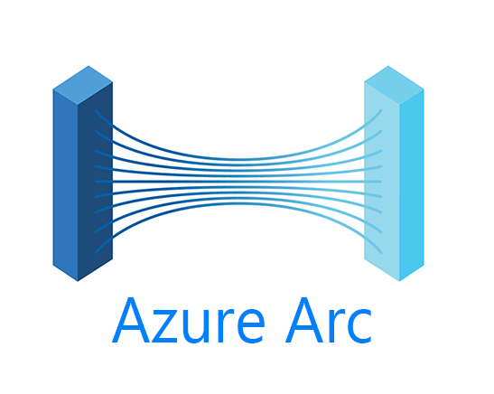

In previous posts, we covered onboarding resources into Azure Arc. Now we move into what makes Arc truly powerful — applying consistent **governance** and **compliance** across hybrid and multicloud environments.

This post focuses on using **Azure Policy**, **Guest Configuration**, and **Defender for Cloud** to manage your Arc-enabled resources at scale.

---

## 🛡️ Why Governance Matters in a Hybrid World

Once you've connected non-Azure resources to Azure Arc, simply having visibility isn't enough. You need to ensure that:
- Required configurations are enforced
- Non-compliant systems are flagged (and optionally remediated)
- Policies span both cloud and on-prem systems
- You maintain a consistent security baseline

Azure Arc lets you apply **the same governance model** to machines and clusters wherever they live — on-premises, AWS, or the edge.

---

## 📜 Applying Azure Policy to Arc Resources

With Azure Policy, you can assign controls to:
- **Arc-enabled servers**
- **Arc-enabled Kubernetes clusters**
- **Arc-registered SQL instances**

Common use cases include:
- Enforcing log collection via Azure Monitor
- Requiring tags for cost tracking
- Auditing insecure protocols (e.g. SMBv1, TLS 1.0)
- Validating OS configurations or software installations

You can assign policies at the subscription or resource group level, just like native Azure VMs.

---

## 🧩 Initiative Definitions and Guest Configuration

When enforcing compliance at scale, group policies into **initiatives** (e.g. CIS benchmarks, ISO27001).

For deeper control over operating systems, use **Guest Configuration**:
- Validate local file contents, registry keys, or config files
- Detect missing updates or misconfigured audit settings
- Works with Windows and many supported Linux distros

> 📝 Tip: Guest Configuration requires the machine to have the Azure Policy extension installed — typically done at onboarding or via Policy.

---

## 🛡️ Defender for Cloud Integration

Arc-enabled machines and Kubernetes can be onboarded into **Defender for Cloud** to enable:
- Vulnerability assessments
- Regulatory compliance scoring
- Just-in-time access recommendations
- Threat detection (SQL, file integrity monitoring, etc.)

Once onboarded, Arc resources appear just like native Azure machines in the Defender portal.

---

## 🧪 Example: Apply a Policy to Enforce Monitoring

```bash
az policy assignment create \
  --name "Require-Log-Analytics" \
  --policy "/providers/Microsoft.Authorization/policyDefinitions/xxx" \
  --scope "/subscriptions/your-sub-id/resourceGroups/Arc-Servers"