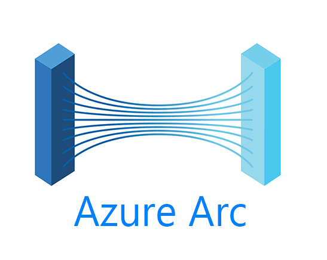

Another post in the Azure Arc Deep Dive series, this time covering Microsoft Extended Support Updates (ESUs).  Within the post I will talk about what ESUs are, the key dates for End of Support (EOS), procurement options, the supported scenarios, the 'must knows' and my own take on things.

---

## 🧩 What Exactly are Extended Support Updates?

Extended Security Updates (ESUs) are a Microsoft offering that provides critical and important security updates for legacy Windows Server and SQL Server versions that have reached end of support (EOS).

Normally, once a product hits EOS, Microsoft no longer provides patches or security updates — but ESUs extend that protection for up to three additional years, giving organisations more time to migrate or modernise.

---

## 📅 Key Dates

Everyone should already be aware of the key ESU dates, they are published by Microsoft [here](https://learn.microsoft.com/en-us/lifecycle/faq/extended-security-updates#esu-availability-and-end-dates).  For the lazy and in a vain effort to keep your attention on this post, I've added the dates below:

| Product                          | End of Extended Support / ESU Start Date | ESU End Date Year 1 | ESU End Date Year 2 | ESU End Date Year 3 | Type of Security Update |
|----------------------------------|------------------------------------------|---------------------|---------------------|---------------------|-------------------------|
| SQL Server 2012                  | July 12, 2022                            | July 11, 2023       | July 9, 2024        | July 8, 2025        | Critical                |
| Windows Server 2012 / 2012R2    | October 10, 2023                         | October 8, 2024     | October 14, 2025    | October 13, 2026    | Critical, Important     |
| SQL Server 2014                  | July 9, 2024                             | July 8, 2025        | July 14, 2026       | July 12, 2027       | Critical                |

There is no ESU availability for Server 2008 or older.
> ❗The end date for SQL Server 2012 has already passed.  Applying ESU to SQL Server 2012 will grant access to three years of Critical updates but no more beyond July 8th 2025.

---

## 📅 Procurement Methods

Microsoft provide various ways of procuring ESUs, the main methods are outlined here:
| ESU Delivery Method           | Where It Applies                  | Pros                                                                 | Cons                                                                   |
|------------------------------|-----------------------------------|----------------------------------------------------------------------|------------------------------------------------------------------------|
| **Azure VMs**                | VMs hosted in Azure               | - Free ESUs included automatically                                   | - Requires full migration to Azure                                     |
| **Azure Stack HCI**          | On-prem via Azure Stack HCI       | - ESUs included as part of the Azure Stack HCI subscription          | - Requires deployment of Azure Stack HCI infrastructure               |
| **Azure Arc-Enabled Servers**| On-prem or 3rd-party cloud VMs    | - No KMS setup needed - Centralised management via Azure - Pay-as-you-go billing | - Requires Azure Arc onboarding - Costs apply per eligible server   |
| **Volume Licensing (VL)**    | On-premises environments          | - Traditional approach for large orgs - No Azure dependency       | - Manual key management - KMS/MAK setup required                    |
| **Cloud Solution Provider (CSP)** | Customers using CSP licensing    | - Flexible pricing and procurement through partners                  | - Availability varies by region and CSP partner

Take the following scenario:
- Server 2012r2 VM
- Server needs protecting with ESUs
- Server will be decomissioned in 6 months time

If the server was hosted within Azure, you could apply ESUs for free.

If the server was hosted outside of Azure, you can apply the ESUs using either the VL, CSP or Azure Arc method, however.. you would have to procure ESUs in 1x year increments through any method other then Azure Arc.  The PAYG model makes the Azure Arc method really attractive.

There is however one small gotcha..
### 💰 Backdated costs
Microsoft will backdate the cost of each ESU license (outside of VMs hosted within Azure) to the start date irrispective of the procurement method - this can be incredibly costly and often a blocker to businesses procuring ESU.

The alternatives are:
- Migrate the VM to Azure to take advantage of the free ESUs
- Upgrade the VM to a later OS
- Migrate the application to a later OS
- Decommission the VM
- ❗Continue to run the VM at risk❗