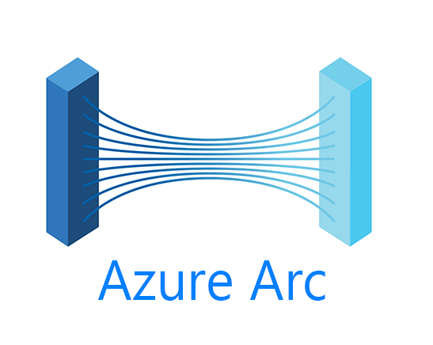

## Overview

## Up Next

In the next post, we’ll explore how to **onboard resources to Azure Arc at scale**, including PowerShell automation, DSC integrations, and template deployments.

*Need help setting up Azure Arc for your environment? Reach out or connect with me on [LinkedIn](https://www.linkedin.com/in/YOUR-HANDLE) or [GitHub](https://github.com/BarryShtPeas).*